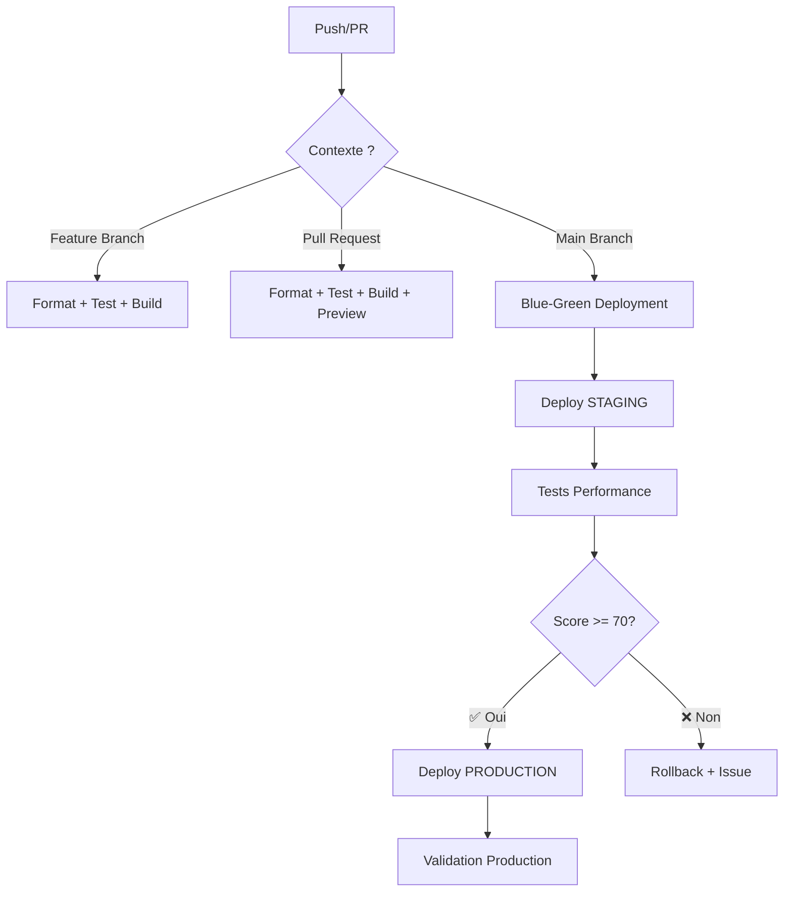

# 🚀 CI/CD Workflows

## Architecture unififiée

Ce projet utilise maintenant **un workflow principal intelligent** qui s'adapte automatiquement au contexte :

### 📋 Workflow principal : `main-cicd.yml`



### 🎯 Déclencheurs et actions

| Contexte                | Déclencheur                             | Actions                             |
| ----------------------- | --------------------------------------- | ----------------------------------- |
| **🟦 Feature Branches** | `push` sur `feature/*`, `develop`, etc. | Format → Test → Build               |
| **🟣 Pull Requests**    | `pull_request` vers `main`              | Format → Test → Build → Preview     |
| **🟢 Production**       | `push` sur `main`                       | Blue-Green complet avec performance |

### 🔧 Logique intelligente

Le workflow détecte automatiquement le contexte grâce au job `setup` :

```yaml
# Exemples de détection
if: github.ref == 'refs/heads/main' && github.event_name == 'push'
  → Déploiement Blue-Green complet

if: github.event_name == 'pull_request'
  → Tests + Preview

else:
  → Tests de base seulement
```

## 📊 Phases d'exécution

### Phase 1-4 : Validation (tous contextes)

1. **Setup** - Analyse du contexte
2. **Code Quality** - Format + Analyse
3. **Tests** - Unitaires + Performance (si nécessaire)
4. **Build** - Compilation Flutter

### Phase 5 : Déploiement conditionnel

- **PR** → Preview Firebase
- **Main** → Blue-Green staging

### Phase 6-11 : Production (main seulement)

6. **Performance Tests** - Validation staging
7. **Production Deploy** - Switch Blue-Green
8. **Production Validation** - Tests de smoke
9. **Rollback** - Si échec automatique
10. **Notifications** - Succès/Échec

## 🎛️ Contrôles de qualité

### Seuils automatiques

- **Performance** : Score >= 70/100
- **Tests** : 100% de passage requis
- **Format** : Code formaté obligatoire
- **Analyse** : Aucun warning critique

### Métriques surveillées

- Temps de réponse moyen < 3s
- Taux d'erreur < 5%
- P95 < 5s
- Disponibilité > 99%

## 🛠️ Workflows complémentaires

### `firebase-hosting-pull-request.yml`

- **Rôle** : Déploiements preview spécialisés
- **Quand** : Pull requests uniquement
- **Actions** : Preview deployments Firebase

## 📁 Fichiers sauvegardés

Les anciens workflows sont conservés en `.backup` :

- `firebase-hosting-merge.yml.backup`
- `blue-green-deployment.yml.backup`
- `performance-testing.yml.backup`
- `performance-gates.yml.backup`

## 🚀 Utilisation

### Développement normal

```bash
# Feature branch - Tests automatiques
git checkout -b feature/nouvelle-fonctionnalite
git push origin feature/nouvelle-fonctionnalite

# Pull Request - Tests + Preview
gh pr create --title "Nouvelle fonctionnalité"

# Production - Blue-Green automatique
git checkout main
git merge feature/nouvelle-fonctionnalite
git push origin main
```

### Déploiement manuel

```bash
# Via GitHub Actions UI
Actions → Main CI/CD Pipeline → Run workflow
Choose: blue-green | direct | rollback
```

### Monitoring

```bash
# Status en temps réel
Actions → Main CI/CD Pipeline → Latest runs

# Artifacts disponibles
- deployment-info-{version}
- staging-performance-reports-{version}
- web-build-{version}
```

## 🔍 Troubleshooting

### Échec de déploiement

1. Vérifier les logs dans Actions
2. Analyser les rapports de performance
3. Utiliser le rollback manuel si nécessaire

### Tests de performance échouent

1. Consulter `staging-performance-reports`
2. Vérifier la connectivité réseau
3. Ajuster les seuils si nécessaire

### Problème de build

1. Vérifier les dépendances Flutter
2. Contrôler le formatage du code
3. Résoudre les warnings d'analyse

## 💡 Avantages de la fusion

✅ **Un seul point d'entrée** - Plus de confusion  
✅ **Logique centralisée** - Maintenance simplifiée  
✅ **Contexte intelligent** - Actions adaptées  
✅ **Performance optimisée** - Pas de doublons  
✅ **Monitoring unifié** - Vue d'ensemble claire

## 🔮 Évolutions futures

- [ ] Tests canary (déploiement graduel)
- [ ] Intégration Slack/Teams
- [ ] Métriques métier en temps réel
- [ ] Déploiement multi-environnements
- [ ] Tests de chaos automatisés
